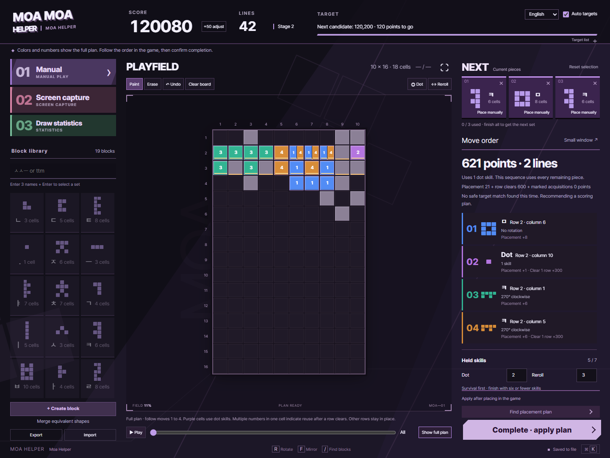

# Moa Helper

Moa Helper is a browser-based puzzle assistant for MapleStory's **Hangul Moa Moa** event, running from **October 1, 2026 at 10:00 AM to October 14, 2026 at 11:59 PM (KST)**. It is an unofficial project for personal use and learning.

Enter the board and three pieces, or read a shared screen, to find a placement plan with rotations, reflections, and available skills. The helper shows the moves; you place the pieces in the game.

[Getting started](#getting-started) · [User guide](docs/guide.md) · [Architecture](docs/architecture.md) · [Testing](docs/testing.md) · [Contributing](CONTRIBUTING.md)



## Getting started

Install [Node.js](https://nodejs.org/) 20 or later, download this repository, and run the following command from the project directory:

```sh
npm start
```

Open [localhost:3210](http://localhost:3210). The application has no runtime package dependencies and requires no installation or build step. On Windows, you can also double-click `start.cmd`. Press `Ctrl+C` in the server console to stop it.

Choose **English** in the language selector at the top of the page. The interface defaults to Korean and remembers your choice in this browser.

The first launch has an empty block library. Choose **Add all default blocks** to load all **19 unique shapes**, or use **Import** to load [`examples/blocks.json`](examples/blocks.json).

Desktop Chrome or Edge is recommended for screen sharing and the optional always-on-top window. The latter requires Document Picture-in-Picture support.

## Playing a set

1. Match the board, score, cleared line count, and skill inventory to the game. In screen-sharing mode, you can paste a screenshot and press the recognition button.
2. Select three pieces. Enter `ㅅㅅㅡ`, or its English keyboard equivalent `ttm`, in the search field and press Enter to fill all three slots.
3. Press Enter again to request a placement plan, or enable **Quick input** to select and search after typing three names. All three pieces appear on the board at once, distinguished by color. Numbers appear when placement order affects the result.
4. Follow the plan in the game, then confirm completion. The helper updates the board, score, skills, and statistics, and clears the three selection slots.

Select a move, play the sequence, or scrub through individual steps to inspect a plan. Previews do not change the saved board. Undo restores an incorrectly committed action.

## Features

| Area | Behavior |
| --- | --- |
| Language | Switches between Korean and English and remembers the choice. Saved block names remain unchanged. |
| Placement search | Prioritizes placing all three pieces, then compares simultaneous clears and future placement space using observed probabilities for the stage reached by each candidate. |
| Screen input | Reads a shared screen manually or every 0.5 seconds with optional auto recognition. Pasted images use the recognition button. Video preview uses native browser playback. |
| Skills | Places dot skills between ordinary pieces and asks for actual reroll results. A completed plan must leave fewer than seven held skills. |
| Target scores | Combines 16 automatic targets from 100,000 upward with saved custom targets. Custom targets also work on their own. Falls back to a scoring plan when a safe target path is unavailable. |
| Draw statistics | A separate screen tracks normal draws and rerolls across all stages and by stage, with direct count editing, filtering, sorting, and undo. |
| Forum export | Copies or downloads plain HTML tables of named block shapes, stage percentages and counts. No CSS or explanatory text. |
| Block library | Includes a dot editor, import/export, and rotation/reflection duplicate detection. Duplicate records merge into the most-observed identity. |
| Keyboard input | Accepts Hangul, English two-set keys, and composed syllables. Quick input searches after three names. Hover a board cell and use 1, 2, or backtick to add or remove ability markers. |
| Game reset | Clears the current run while keeping the block library, observations and preferences. Undo restores the previous game. |
| Restart advice | Flags crowded boards with difficult gaps and limited recovery, with the affected cells, shapes and skills shown. Resetting remains manual. |
| Always-on-top view | Shows the plan and completion control in a separate supported browser window. |

Recognized pieces are counted only after their placements are committed. Re-reading or correcting the same image does not count another draw.

## Search budget and measured results

The solver runs in a Web Worker with an **850ms search budget**. A **950ms browser watchdog** recovers the latest available plan. Browser scheduling and system load can delay display beyond that time.

Six current-policy simulations scored 106,403 to 500,000, averaging 260,550. Five ended in verified death; one reached the cap. Four reached 200,000, so a 200,000-point minimum has not been achieved. The 2,767 recommendations averaged about 258ms with a maximum of 685ms. The runs used observed stage distributions, and four seeds had already been used for tuning. See the [full results, failed experiments and conditions](docs/benchmarks.md).

Future draws are unknown. The search compares candidate boards against the registered next-piece distribution within its time budget, with sampled hands as a fallback. It cannot guarantee a globally optimal plan or an exact target score. Rerolls require actual replacement input and another recommendation.

## Online version

Open any of the following addresses. Each domain has separate browser progress; all four share the same public draw statistics.

- [moa.chocolily.dev](https://moa.chocolily.dev)
- [moa.moria-luluka.com](https://moa.moria-luluka.com)
- [moa.morialuluka.com](https://moa.morialuluka.com)
- [moa.응가.tv](https://moa.xn--o39a013c.tv)

The hosted service requires Node.js 22.13 or later. The local application still supports Node.js 20 or later. See [hosting and data handling](docs/hosting.md).

## Data and privacy

In local mode, blocks, board state, skills, score, and statistics are stored in `data/state.json`. Back up the `data` directory to preserve a game. Block export contains only the block library.

The local server binds to `127.0.0.1`. Video and clipboard images are analyzed in the browser and are not sent to the server. Pretendard is bundled locally, so the running application requires no external service connection. Personal saves, generated test output, and installed packages are excluded from the source bundle.

## Development

```sh
npm ci
npm test
npm run test:parallel
npm run check:release
```

Validation uses Node and isolated temporary state. Do not launch browser tests or a web server. See [Project constraints](AGENTS.md) and [Testing](docs/testing.md).

On Windows, `test-500k.cmd` starts two concurrent games with automatic targets enabled and no setup prompts. Each runs without artificial rest until 500,000 points or verified death. Scores, target arrivals, and checkpoints are saved under `test-results`. The existing `test-targets.cmd` retains its low-load comparison menu.

To create a source ZIP for a new GitHub repository:

```sh
npm run release:bundle
```

Extract `releases/moa-helper-github.zip` and use its `moa-helper` directory as the repository root. It contains source, documentation, examples, tests, and contribution templates. See [Publishing](docs/publishing.md) for the remaining steps.

## Documentation

- [User guide](docs/guide.md): input, capture, skills, targets, statistics, and backups
- [Architecture](docs/architecture.md): modules, search, and state transitions
- [Testing](docs/testing.md): Node checks, 500k runs, and comparisons through death
- [Contributing](CONTRIBUTING.md): change scope, reproduction cases, and validation
- [Security](SECURITY.md): local and hosted isolation, public statistics, and vulnerability reporting

## Disclaimer and license

MapleStory trademarks, logos, game images, and related rights belong to Nexon and their respective rights holders. This project is made for personal use and learning. It is not developed, approved, endorsed, or sponsored by Nexon and is not affiliated with MapleStory or TETR.IO.

Source code is available under the [MIT license](LICENSE). Bundled fonts and game reference images have [separate notices](THIRD_PARTY_NOTICES.md). The code license does not grant rights to MapleStory assets or trademarks.
