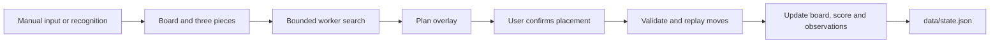

# Architecture

[README](../README.md) · [Testing](testing.md)

The application consists of static HTML, CSS, and JavaScript, a search Web Worker, and a Node.js storage server. It uses no framework or bundler. Source images stay in the browser; the server provides files and a state API.

## State transitions

[`app.js`](../public/app.js) connects interface events to state. Changing the board or pieces cancels the active search. Search and replay previews do not commit placements.

[`plan.js`](../public/plan.js) replays a plan against the current state before committing it. It checks collisions, cleared rows, ability acquisition, and skill consumption. Complete plans, partial plans, target prefixes, and prefixes before a reroll share this path. A failed validation does not save a partially applied plan.

[`statistics.js`](../public/statistics.js) separates normal draws from rerolls and retains each draw's stage and recorded state. Pending recognized draws survive a restart. Re-reading or correcting a piece preserves the origin of the observation.

[`library.js`](../public/library.js) identifies equivalent shapes across translation, four rotations, and reflection. Consolidation retains the most-observed block identity, sums source and stage counts, and remaps active block references without altering their piece geometry or draw markers.

## Search

[`solver.js`](../public/solver.js) implements normalization, transformations, collisions, and horizontal row clearing. Each board row is an integer bitmask. Clearing a row does not move other cells.

[`fast.js`](../public/fast.js) first seeks a path that places every remaining piece, then compares candidates generated by [`search.js`](../public/search.js). It can insert available dot skills and validates the final inventory cap. [`policy.js`](../public/policy.js) evaluates simultaneous clears, empty space, and legal placements for registered shapes. When time remains, leading candidates face the same sampled next set.

[`targets.js`](../public/targets.js) defines target scores and scores move prefixes. A target stopping point requires a legal continuation for the remaining pieces and fewer than seven held skills. If no suitable target path is found, the solver returns its regular scoring plan.

The search budget is 850ms. A 950ms timer in the main browser thread terminates a stalled worker and recovers its latest plan. A partial path or proposed reroll may be returned when a complete path is unavailable. Failing to find a plan within the budget is not treated as confirmed death.

Future-piece evaluation uses smoothed overall normal-draw observations. Stage-specific records are available in the interface and simulation draw model; the current recommendation evaluator receives overall statistics. Future ability positions and acquisitions are not supplied to the search.

## Capture and presentation

[`capture.js`](../public/capture.js) uses a native video element for playback and a transparent canvas for overlays. The recognition button copies one frame for [`vision.js`](../public/vision.js). Adjusting sensitivity or calibration does not trigger another recognition pass. [`capture-state.js`](../public/capture-state.js) reconciles observations with the existing slots.

[`studio.js`](../public/studio.js) manages selection motion, plan playback, focus mode, and keyboard navigation. Animations and timers run during interactions. Hidden documents and reduced-motion settings cancel decorative effects. This module does not add a capture-processing loop.

Layout is defined in [`index.html`](../public/index.html), [`manual.css`](../public/manual.css), and [`tokens.css`](../public/tokens.css). A local Pretendard variable font supplies the interface typography.

[`i18n.js`](../public/i18n.js) selects Korean source messages or the [English catalog](../public/locales/en.js). Static labels bind once at startup; dynamic views render again when the language changes. Message templates keep block names and other values separate from translated text. The `moa-language-v1` localStorage preference applies across tabs. Changing language does not change game state, restart search, or recognize another frame.

## Persistence

[`server.mjs`](../server.mjs) listens on `127.0.0.1`, port 3210 by default. GET `/api/state` reads state; PUT validates and saves it. Host and Origin checks restrict local access. Static files are resolved under `public`.

[`storage.mjs`](../storage.mjs) validates field types and ranges, serializes writes, and replaces the state file through a temporary file. A browser recovery copy covers failed server writes. User state is excluded from public source bundles.
