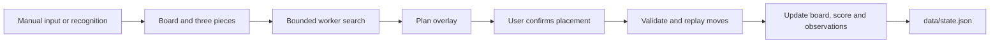

# Architecture

[README](../README.md) · [Testing](testing.md)

The application consists of static HTML, CSS, and JavaScript, a search Web Worker, and a Node.js storage server. It uses no framework or bundler. Source images stay in the browser; the server provides files and a state API.

## State transitions

[`app.js`](../public/app.js) connects interface events to state. Changing the board or pieces cancels the active search. Search and replay previews do not commit placements.

[`plan.js`](../public/plan.js) replays a plan against the current state before committing it. It checks collisions, cleared rows, ability acquisition, and skill consumption. Complete plans, partial plans, target prefixes, and prefixes before a reroll share this path. A failed validation does not save a partially applied plan.

[`statistics.js`](../public/statistics.js) separates normal draws from rerolls and retains each draw's stage and recorded state. Pending recognized draws survive a restart. Re-reading or correcting a piece preserves the origin of the observation.

[`library.js`](../public/library.js) identifies equivalent shapes across translation, four rotations, and reflection. Consolidation retains the most-observed block identity, sums source and stage counts, and remaps active block references without altering their piece geometry or draw markers.

## Search

[`solver.js`](../public/solver.js) implements normalization, transformations, collisions, and horizontal row clearing. Each board row is an integer bitmask. Clearing a row does not move other cells.

[`fast.js`](../public/fast.js) first seeks a path that places every remaining piece, then compares candidates generated by [`search.js`](../public/search.js). It can insert available dot skills and validates the final inventory cap. [`policy.js`](../public/policy.js) penalizes occupied rows, narrow gaps, and cells that few likely shapes can fill. A shape contributes its probability to a cell once, regardless of how many orientations cover it.

When time remains, up to six candidate boards are evaluated against every registered identity for the next placement. Each identity's best legal placement contributes to an expected board value and a probability-weighted worst quartile. Blocked identities retain their probability mass and receive a loss penalty. At least two fully enumerated candidates are needed to change the winner; an unfinished enumeration is discarded. This covers one future piece, not every possible sequence of future hands.

Equivalent board reflections and half-turns share probability evaluations when the enabled shape transformations permit them. The final comparison keeps distinct geometries instead of spending its candidate slots on their symmetric copies. Current-hand search still distinguishes marker positions, inventory and target paths.

If enumeration cannot complete, the fallback compares two candidates against common sampled hands. A bounded exhaustive check distinguishes proven unplaceable hands from search timeouts. Proven failures remain in the comparison, while an unresolved hand cannot favor either candidate.

Dot costs rise when few remain, and marked dot acquisitions receive more search value than reroll acquisitions. These values affect ranking only; displayed points still follow the game's scoring rules. At capacity, a reroll is preferred when at most two dots remain. A preventive reroll can also be proposed before a damaging placement, using the observed reroll distribution. All sampled replacements must have a result before that comparison can recommend spending a skill. The player supplies the actual replacement before placement search resumes.

[`targets.js`](../public/targets.js) combines enabled automatic targets with validated custom targets and scores move prefixes against that list. Search, HUD progress and prefix confirmation use the same active targets. Removing a target invalidates its recommendation. A target stopping point requires a legal continuation for the remaining pieces and fewer than seven held skills. If no suitable target path is found, the solver returns its regular scoring plan.

The search budget is 850ms. A 950ms timer in the main browser thread terminates a stalled worker and recovers its latest plan. A partial path or proposed reroll may be returned when a complete path is unavailable. Failing to find a plan within the budget is not treated as confirmed death.

The worker receives the current cleared-line count and saved statistics. Every candidate's placement-space evaluation uses the normal-draw distribution for the stage reached after that candidate's clears, even when there is no time for sampled lookahead. Stage counts use a 30-observation prior from overall counts; overall normal counts have one prior observation per saved identity. Missing stage records fall back to overall counts, and missing observations fall back to a uniform prior. Unknown and deleted identities are excluded. Reroll observations never enter the normal-draw distribution.

The simulation draw model uses the same probability function, with separate normal and reroll sources. Reroll weights use a normal-distribution prior when samples are sparse. These are estimates from observations, not the game's published odds. Placement-space risk measures currently blocked shapes, not a calibrated death probability. Future ability positions and acquisitions are not supplied to the search, and future-hand checks do not assume rescue skills.

Restart advice examines the board after the proposed plan: occupancy, blocked identities, hard-to-fill gaps, and remaining recovery skills. It waits for unresolved rerolls. The advice is a structural warning with no final-score forecast. It never commits a reset, alters search ranking, or terminates a benchmark.

## Capture and presentation

[`capture.js`](../public/capture.js) uses a native video element for playback and a transparent canvas for overlays. The recognition button copies one frame for [`vision.js`](../public/vision.js). An optional 500 ms timer reads live frames without overlapping passes. It pauses during calibration, dialogs, and the statistics view, and stops when sharing ends. Pasted images are not polled. Adjusting sensitivity or calibration does not itself trigger recognition. [`capture-state.js`](../public/capture-state.js) reconciles observations with the existing slots.

Automatic recognition holds the accepted plan until completion. The next observation must match the committed board before it can replace the hand; duplicate observations do not write state or restart the solver. Rerolls and target stopping points retain their explicit confirmation steps. The manual button can override the automatic wait to correct an observation. The automatic-recognition preference is stored in browser local storage, separately from game state.

Board detection joins matching background extents across interruptions from placed blocks and ability glows, then fits the grid. Cell classification checks the tile corners so an ability symbol over an empty cell does not count as a block. If saved regions fail recognition after the game panel moves, the same captured frame is checked for a new board and three readable cards. Calibration changes only when that replacement passes the recognition checks.

Miniature tile spacing is initialized from the game board's scale and refined from distances between detected tiles. A blue tile's saturated interior can be narrower than its full cell; using that interior as the spacing would insert false gaps in connected shapes. Resampling can also join neighboring tile interiors, which are split at the expected grid spacing. Genuine gaps remain empty. Calibration labels appear only while the region controls are open or a region is being dragged.

[`studio.js`](../public/studio.js) manages selection motion, plan playback, focus mode, and keyboard navigation. Animations and timers run during interactions. Hidden documents and reduced-motion settings cancel decorative effects. This module does not add a capture-processing loop.

Manual, capture, and statistics are separate views with hash history. Opening statistics hides the playfield without committing moves or stopping a live stream. Clipboard images are accepted only in the visible capture view.

Layout is defined in [`index.html`](../public/index.html), [`manual.css`](../public/manual.css), and [`tokens.css`](../public/tokens.css). A local Pretendard variable font supplies the interface typography.

[`i18n.js`](../public/i18n.js) selects Korean source messages or the [English catalog](../public/locales/en.js). Static labels bind once at startup; dynamic views render again when the language changes. Message templates keep block names and other values separate from translated text. The `moa-language-v1` localStorage preference applies across tabs. Changing language does not change game state, restart search, or recognize another frame.

## Persistence

[`server.mjs`](../server.mjs) listens on `127.0.0.1`, port 3210 by default. GET `/api/state` reads state; PUT validates and saves it. Host and Origin checks restrict local access. Static files are resolved under `public`.

[`storage.mjs`](../storage.mjs) validates field types and ranges, serializes writes, and replaces the state file through a temporary file. A browser recovery copy covers failed server writes. User state is excluded from public source bundles.

Custom targets and the quick-input preference are stored with game state. Legacy saves default to no custom targets and quick input off. [`game-state.js`](../public/game-state.js) resets run counters, pieces and abilities while retaining observations, the library and preferences. The UI records the previous state for undo and cancels any active search before displaying the reset game.
