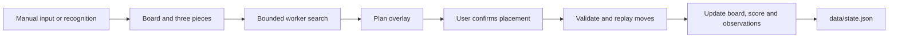

# Architecture

[README](../README.md) · [Testing](testing.md)

The application consists of static HTML, CSS, and JavaScript, a search Web Worker, and a Node.js storage server. It uses no framework or bundler. Source images stay in the browser; the server provides files and a state API.

## State transitions

[`app.js`](../public/app.js) connects interface events to state. Changing the board or pieces cancels the active search. Search and replay previews do not commit placements.

[`plan.js`](../public/plan.js) replays a plan against the current state before committing it. It checks collisions, cleared rows, ability acquisition, and skill consumption. Complete plans, partial plans, target prefixes, and prefixes before a reroll share this path. A failed validation does not save a partially applied plan.

[`statistics.js`](../public/statistics.js) separates normal draws from rerolls and retains each draw's stage and recorded state. Pending recognized draws survive a restart. Re-reading or correcting a piece preserves the origin of the observation.

[`library.js`](../public/library.js) identifies equivalent shapes across translation, four rotations, and reflection. Consolidation retains the most-observed block identity, sums source and stage counts, and remaps active block references without altering their piece geometry or draw markers.

## Search

[`solver.js`](../public/solver.js) implements normalization, transformations, collisions, and horizontal row clearing. Each board row is an integer bitmask. Clearing a row does not move other cells.

[`native-solver.js`](../public/native-solver.js) adapts the supplied native25 engine to the existing input and result formats. The unmodified WebAssembly payload is loaded by [`native-engine.js`](../public/native-engine.js). The same ensemble strategy runs in progressively deeper passes (beam widths 128, 320 and 640), up to the original probe width of 32, eight scenarios and 24 finalists. Completed passes publish replay-validated results. Open-space scoring and affordable-hole penalties are retained. The binary has no imports and cannot access browser or host APIs.

The native engine handles the standard 10 × 16 board with rotation and reflection enabled and shapes fitting a 5 × 5 bounding box. Other boards and settings use [`fast.js`](../public/fast.js). A short JavaScript search also publishes a legal backup before the native call. Native output is replayed to validate piece identity, geometry, collisions, cleared rows and skill availability. Scores are recomputed from the existing rules; the engine cannot commit state directly. Known dot acquisitions can be spent later in the same plan.

Stage-specific normal observations are mapped to canonical shape keys. A stage without samples uses overall normal observations; an unknown current stage uses the overall distribution. Reroll records, unidentified shapes and deleted identities do not enter normal-draw counts. The engine retains its own sampling prior. Held skills and existing marked abilities are included. Unknown future icon positions and the reference interface's pause-on-spawn behavior are excluded: icon entry and the spawn counter continue to use the existing manual workflow.

[`targets.js`](../public/targets.js) remains the source of automatic and manual targets. Move-order refinement checks exact score prefixes. Near a target, a bounded supplementary search can offer an alternative only when it preserves complete placement, catalogue coverage and the native plan's placement bottleneck. Completion must leave fewer than seven skills. Capacity handling can add a legal dot or request a real reroll; replacement outcomes are never invented.

Deeper passes can take several seconds and may be interrupted before reaching the original maximum search width. The application and simulation harness share a 4.9-second watchdog, reserving 100ms of the five-second budget for message dispatch and display. The compatibility search remains bounded to 850ms. Legacy saved profile fields are retained for save-file compatibility; they do not force the native engine back to the former one-second mode. A timeout or partial path is not proof of death.

The simulation draw model continues to use the existing observed distributions with separate normal and reroll sources. Historical JavaScript-policy scores do not measure the new native engine.

Restart advice examines the board after the proposed plan: occupancy, blocked identities, hard-to-fill gaps, and remaining recovery skills. It waits for unresolved rerolls. The advice is a structural warning with no final-score forecast. It never commits a reset, alters search ranking, or terminates a benchmark.

## Capture and presentation

[`capture.js`](../public/capture.js) uses a native video element for playback and a transparent canvas for overlays. The recognition button copies one frame for [`vision.js`](../public/vision.js). An optional 500 ms timer reads live frames without overlapping passes. It pauses during calibration, dialogs, and the statistics view, and stops when sharing ends. Pasted images are not polled. Adjusting sensitivity or calibration does not itself trigger recognition. [`capture-state.js`](../public/capture-state.js) reconciles observations with the existing slots.

Automatic recognition holds the accepted plan until completion. The next observation must match the committed board before it can replace the hand; duplicate observations do not write state or restart the solver. Rerolls and target stopping points retain their explicit confirmation steps. The manual button can override the automatic wait to correct an observation. The automatic-recognition preference is stored in browser local storage, separately from game state.

Board detection joins matching background extents across interruptions from placed blocks and ability glows, then fits the grid. Cell classification checks the tile corners so an ability symbol over an empty cell does not count as a block. If saved regions fail recognition after the game panel moves, the same captured frame is checked for a new board and three readable cards. Calibration changes only when that replacement passes the recognition checks.

Miniature tile spacing is initialized from the game board's scale and refined from distances between detected tiles. A blue tile's saturated interior can be narrower than its full cell; using that interior as the spacing would insert false gaps in connected shapes. Resampling can also join neighboring tile interiors, which are split at the expected grid spacing. Genuine gaps remain empty. Calibration labels appear only while the region controls are open or a region is being dragged.

[`studio.js`](../public/studio.js) manages selection motion, plan playback, focus mode, and keyboard navigation. Animations and timers run during interactions. Hidden documents and reduced-motion settings cancel decorative effects. This module does not add a capture-processing loop.

Manual, capture, and statistics are separate views with hash history. Opening statistics hides the playfield without committing moves or stopping a live stream. Clipboard images are accepted only in the visible capture view.

Layout is defined in [`index.html`](../public/index.html), [`manual.css`](../public/manual.css), and [`tokens.css`](../public/tokens.css). A local Pretendard variable font supplies the interface typography.

[`i18n.js`](../public/i18n.js) selects Korean source messages or the [English catalog](../public/locales/en.js). Static labels bind once at startup; dynamic views render again when the language changes. Message templates keep block names and other values separate from translated text. The `moa-language-v1` localStorage preference applies across tabs. Changing language does not change game state, restart search, or recognize another frame.

## Persistence

[`server.mjs`](../server.mjs) listens on `127.0.0.1`, port 3210 by default. GET `/api/state` reads state; PUT validates and saves it. Host and Origin checks restrict local access. Static files are resolved under `public`.

[`storage.mjs`](../storage.mjs) validates field types and ranges, serializes writes, and replaces the state file through a temporary file. A browser recovery copy covers failed server writes. User state is excluded from public source bundles.

Custom targets and the quick-input preference are stored with game state. Legacy saves default to no custom targets and quick input off. [`game-state.js`](../public/game-state.js) resets run counters, pieces and abilities while retaining observations, the library and preferences. The UI records the previous state for undo and cancels any active search before displaying the reset game.
